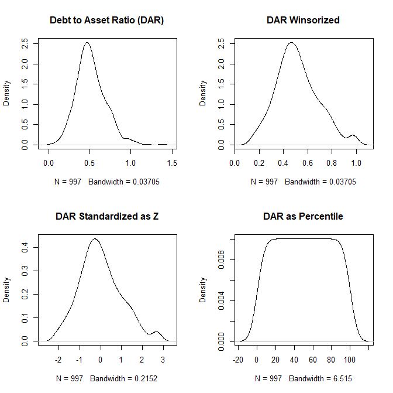

# fiscal 

An R package for calculating nonprofit fiscal health accounting metrics from IRS 990 data. 

<br>

---------------------

<br>

## Install the package

```r

devtools::install_github( 'nonprofit-open-data-collective/fiscal' )

```

<br>

```r
library( fiscal )
help( get_dar )  # function documentation 

# create test data: x1=debt, x2=assets
x1 <- rnorm(1000,100,30)
x2 <- rnorm(1000,200,30)
x2[ c(15,300,600) ] <- 0
dat <- data.frame(x1,x2)

# test the debt-to-asset ration function
dat <- get_dar( df=dat, debt="x1", assets="x2" )

# [1] "Assets cannot be zero: 3 cases have been replaced with NA."
#
#       dar               dar.w             dar.z              dar.p       
#  Min.   :-0.08372   Min.   :0.09009   Min.   :-2.36716   Min.   :  1.00  
#  1st Qu.: 0.39247   1st Qu.:0.39247   1st Qu.:-0.67281   1st Qu.: 25.00  
#  Median : 0.50623   Median :0.50623   Median :-0.03536   Median : 50.00  
#  Mean   : 0.51315   Mean   :0.51254   Mean   : 0.00000   Mean   : 50.35  
#  3rd Qu.: 0.62853   3rd Qu.:0.62853   3rd Qu.: 0.64995   3rd Qu.: 75.00  
#  Max.   : 1.24623   Max.   :1.00150   Max.   : 2.73988   Max.   :100.00  
#  NA's   :3          NA's   :3         NA's   :3          NA's   :3

# fiscal health metrics have been appended to the original dataframe
head( dat ) 

# the function is piping enabled 
dat <- 
  dat %>% 
  get_dar( debt="x1", assets="x2" )
```

<br>

## Results 

The functions are designed to create multiple versions of the fiscal health metric, print summary statistics, and visualize the density distribution. The four versions are added back to the original dataset. 

For example, the Debt to Asset Ratio function **get_dar()** creates the following: 

* dar = the debt-to-asset ratio (DAR) 
* dar.w = the winsorized version of DAR 
* dar.z = the standard normal (z-score) version of DAR 
* dar.p = the DAR as percentiles  

```r
dat <- get_dar( df=dat, debt="x1", assets="x2" )

# [1] "Assets cannot be zero: 3 cases have been replaced with NA."
#
#       dar               dar.w             dar.z              dar.p       
#  Min.   :-0.08372   Min.   :0.09009   Min.   :-2.36716   Min.   :  1.00  
#  1st Qu.: 0.39247   1st Qu.:0.39247   1st Qu.:-0.67281   1st Qu.: 25.00  
#  Median : 0.50623   Median :0.50623   Median :-0.03536   Median : 50.00  
#  Mean   : 0.51315   Mean   :0.51254   Mean   : 0.00000   Mean   : 50.35  
#  3rd Qu.: 0.62853   3rd Qu.:0.62853   3rd Qu.: 0.64995   3rd Qu.: 75.00  
#  Max.   : 1.24623   Max.   :1.00150   Max.   : 2.73988   Max.   :100.00  
#  NA's   :3          NA's   :3         NA's   :3          NA's   :3
```



<br> 

-----------------

<br>
<br>
<br>


**ADD ALL METRICS TO DATASET**

```r
library( dplyr )
library( fiscal )

# IRS EFILE DATA - see irs990efile package

d1 <- readRDS( "F9-P09-T00-EXPENSES-2018.rds" )
d2 <- readRDS( "F9-P01-T00-SUMMARY-2018.rds" )
d3 <- readRDS( "F9-P10-T00-BALANCE-SHEET-2018.rds" )
df <- merge( d1, d2 )
df <- merge( df, d3 )

df <- get_aer( df )     #	Assets to Revenues Ratio
df <- get_arr( df )     #	Assets to Revenues Ratio
df <- get_cr( df )      # Current Ratio
df <- get_dar( df )     #	Debt to Asset Ratio
df <- get_der( df )     #	Debt to Equity Ratio
df <- get_dgdr( df )    #	Donation/Grant Dependence Ratio
df <- get_dmr( df )     #	Debt Management Ratio
df <- get_doch( df )    #	Days of Operating Cash on Hand
df <- get_doci( df )    #	Days of Operating Cash and Investments
df <- get_eidr( df )    #	Earned Income Dependence Ratio
df <- get_er( df )      #	Equity Ratio
df <- get_ggr( df )     #	Government Grants Ratio
df <- get_iidr( df )    #	Investment Income Dependence Ratio
df <- get_lar( df )     #	Lands to Assets Ratio
df <- get_moch( df )    #	Months of Operating Cash on Hand
df <- get_or( df )      #	Operating Margin
df <- get_per( df )     #	Program Efficiency Ratio
df <- get_podpm( df )   #	Post-Depreciation Profitability Margin
df <- get_predpm( df )  # Pre-Depreciation Profitability Margin
df <- get_qr( df )      #	Quick Ratio
df <- get_ssr( df )     #	Self Sufficiency Ratio
df <- get_stdr( df )    #	Short Term Debt Ratio
```

