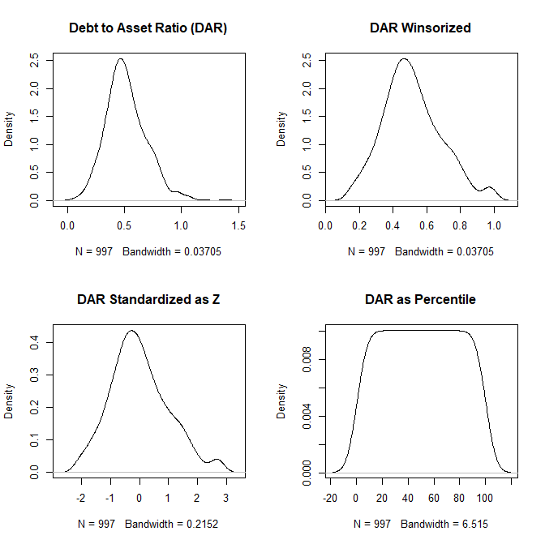

# fiscal 

An R package for calculating nonprofit fiscal health accounting metrics from IRS 990 data. 

<br>

---------------------

<br>

## Install the package

```r

devtools::install_github( 'nonprofit-open-data-collective/fiscal' )

```

<br>
<hr>
<br>

## Example Ratio: Debt to Asset Ratio

```r
library( fiscal )
help( get_debt_assets_ratio )  # function documentation 
```

**Description**
Calculate the debt to asset ratio and append it to the dataframe.

```
debt_assets = total_liabilities / total_assets
```

**Usage**
```
  get_debt_assets_ratio( df, 
                         debt   = c( "F9_10_LIAB_TOT_EOY", "F9_01_NAFB_LIAB_TOT_EOY" ),
                         assets = c( "F9_10_ASSET_TOT_EOY", "F9_01_NAFB_ASSET_TOT_EOY" ),
                         winsorize = 0.98,
                         sanitize  = TRUE,
                         summarize = FALSE )
```

**Arguments**

* `df`: A data.frame containing the required fields for computing the metric. The metric will be appended to this dataset.
* `debt`: Column name(s) for total liabilities. (On 990: Part X, line 26B; `F9_10_LIAB_TOT_EOY`. On EZ: Part II, line 26B; `F9_01_NAFB_LIAB_TOT_EOY`.)
* `assets`: Column name(s) for total assets, EOY. (On 990: Part X, line 16B; `F9_10_ASSET_TOT_EOY`. On EZ: Part II, line 25B; `F9_01_NAFB_ASSET_TOT_EOY`.)
* `winsorize`: The winsorization value (between 0 and 1), defaults to 0.98 which winsorizes at the 1st and 99th percentile values.
* `sanitize`: If `TRUE` (default), imputes zero for NA values in financial fields before computing the ratio, respecting form scope.
* `summarize`: If `TRUE`, prints summary statistics and plots density curves for all four output columns.

```r
df <- dat10k   # sample of 10,000 rows from efile financials

# compute the debt-to-asset ratio
df <- get_debt_assets_ratio( df )

# fiscal health metrics have been appended to the original dataframe
head( df ) 

# defaults to efile variable names
# but you can override with your own column names
df <- get_debt_assets_ratio( df, debt = "my_liabilities", assets = "my_assets" )

# the function is pipe-enabled 
df <- 
  df %>% 
  get_debt_assets_ratio()
  
# compute all ratio metrics at once
df <- compute_all( df, metrics = c("ratio","w","z","p") )
```

The `metrics` argument controls which versions are returned:

| Value | Description |
|-------|-------------|
| `"ratio"` | Raw financial ratio |
| `"w"` | Winsorized version |
| `"z"` | Z-score (standardized) version |
| `"p"` | Percentile rank (1–100) |

The `append_to_df` argument controls the output shape:

| Value | Returns |
|-------|---------|
| `TRUE` (default) | Original data frame with metric columns appended |
| `FALSE` | Efile identifier columns + metric columns only |

<br>
<hr>
<br>

## Results 

The functions are designed to create multiple versions of the fiscal health metric, print summary statistics, and visualize the density distribution. The four versions are added back to the original dataset. 

For example, `get_debt_assets_ratio()` creates the following columns: 

* `debt_assets`   — the raw debt-to-asset ratio
* `debt_assets_w` — the winsorized version
* `debt_assets_z` — standardized as a z-score
* `debt_assets_p` — expressed as a percentile rank  

```r
df <- get_debt_assets_ratio( df = dat10k, summarize = TRUE )

# [1] "Assets equal to zero: 3 cases have been replaced with NA."
#
#    debt_assets       debt_assets_w     debt_assets_z      debt_assets_p    
#  Min.   :-0.08372   Min.   :0.09009   Min.   :-2.36716   Min.   :  1.00  
#  1st Qu.: 0.39247   1st Qu.:0.39247   1st Qu.:-0.67281   1st Qu.: 25.00  
#  Median : 0.50623   Median :0.50623   Median :-0.03536   Median : 50.00  
#  Mean   : 0.51315   Mean   :0.51254   Mean   : 0.00000   Mean   : 50.35  
#  3rd Qu.: 0.62853   3rd Qu.:0.62853   3rd Qu.: 0.64995   3rd Qu.: 75.00  
#  Max.   : 1.24623   Max.   :1.00150   Max.   : 2.73988   Max.   :100.00  
#  NA's   :3          NA's   :3         NA's   :3          NA's   :3
```




<br>
<hr>
<br>


**ADD ALL METRICS TO DATASET**

```r
library( fiscal )

# retrieve efile data directly from NCCS
df <- retrieve_efile_data( year = 2021 )

# compute all metrics at once
df <- compute_all( df )

# or add individual metrics
df <- get_assets_revenue_ratio( df )           # Asset Revenue Ratio
df <- get_cash_assets_ratio( df )              # Cash and Savings to Assets Ratio
df <- get_cash_burn_ratio( df )                # Burn Rate Ratio
df <- get_cash_liquidity_ratio( df )           # Cash Liquidity Ratio
df <- get_cash_on_hand( df )                   # Cash on Hand (dollar amount)
df <- get_current_ratio( df )                  # Current Ratio
df <- get_days_cash_investments( df )          # Days of Cash and Investments
df <- get_days_cash_operations( df )           # Days of Cash on Hand
df <- get_debt_assets_ratio( df )              # Debt to Asset Ratio
df <- get_debt_equity_ratio( df )              # Debt to Equity Ratio
df <- get_debt_netassets_ratio( df )           # Debt to Net Assets Ratio
df <- get_debt_secured_ratio( df )             # Secured Debt Ratio
df <- get_debt_shortterm_ratio( df )           # Short Term Debt Ratio
df <- get_debt_unsecured_ratio( df )           # Unsecured Debt Ratio
df <- get_donations_revenue_ratio( df )        # Donation and Grant Dependence Ratio
df <- get_earned_income_ratio( df )            # Earned Income Dependency Ratio
df <- get_equity_ratio( df )                   # Equity Ratio
df <- get_expenses_admin_ratio( df )           # Administrative Overhead Ratio
df <- get_expenses_affiliates_ratio( df )      # Payments to Affiliates Ratio
df <- get_expenses_compensation_ratio( df )    # Compensation Expense Ratio
df <- get_expenses_feesforservice_ratio( df )  # Fees for Services Ratio
df <- get_expenses_grants_ratio( df )          # Grants-to-Others Expense Ratio
df <- get_expenses_membbenefits_ratio( df )    # Member Benefits Expense Ratio
df <- get_fundraising_efficiency_ratio( df )   # Fundraising Efficiency Ratio
df <- get_grants_govt_ratio( df )              # Government Grant Ratio
df <- get_investment_income_ratio( df )        # Investment Income Dependency Ratio
df <- get_investments_assets_ratio( df )       # Investment Assets Ratio
df <- get_land_assets_gross_ratio( df )        # Land, Buildings, Equipment Ratio (Gross)
df <- get_land_assets_net_ratio( df )          # Land, Buildings, Equipment Ratio (Net)
df <- get_liquid_assets_months( df )           # Liquid Unrestricted Net Assets (Months)
df <- get_months_cash_operations( df )         # Months of Cash on Hand
df <- get_netassets_composition_ratio( df )    # Net Assets Composition Ratio
df <- get_netassets_growth_ratio( df )         # Net Assets Growth Ratio
df <- get_operating_reserve_ratio( df )        # Operating Reserve Ratio
df <- get_overhead_ratio( df )                 # Overhead Ratio (mgmt + fundraising)
df <- get_profit_margin_postdepr( df )         # Post-Depreciation Profit Margin
df <- get_profit_margin_predepr( df )          # Pre-Depreciation Profit Margin
df <- get_program_expenses_ratio( df )         # Program Expense Ratio
df <- get_quick_ratio( df )                    # Quick Ratio
df <- get_return_assets_ratio( df )            # Return on Assets
df <- get_return_netassets_ratio( df )         # Return on Net Assets
df <- get_revenue_fedcampaign_ratio( df )      # Federated Campaign Revenue Ratio
df <- get_revenue_fundevents_ratio( df )       # Fundraising Events Revenue Ratio
df <- get_revenue_membdues_ratio( df )         # Membership Dues Revenue Ratio
df <- get_revenue_programs_ratio( df )         # Program Service Revenue Ratio
df <- get_revenue_reltdorgs_ratio( df )        # Related Organizations Revenue Ratio
df <- get_self_sufficiency_ratio( df )         # Self Sufficiency Ratio
df <- get_surplus_margin_ratio( df )           # Surplus Margin
```

<br>
<hr>
<br>

## Panel Data Workflow

The package includes three functions for building and preparing multi-year panel datasets from the IRS 990 efile data.

### get_panel()

Downloads multiple years of IRS 990 efile data and stacks them into a single long-format panel. Each year is retrieved independently via `retrieve_efile_data()`, stamped with `TAX_YEAR`, and combined with `dplyr::bind_rows()` — columns that appear in some years but not others are filled with `NA`.

```r
# Retrieve a 4-year panel with default tables (P00, P01, P08, P09, P10)
panel <- get_panel( years = 2019:2022 )

dim( panel )
table( panel$TAX_YEAR )

# Retrieve without BMF metadata (faster; attach manually later)
panel <- get_panel( years = 2019:2022, include_bmf = FALSE )
```

### deduplicate()

IRS 990 efile data can contain multiple filings per organization per year (amended returns, partial-year returns, group returns). `deduplicate()` reduces the panel to at most one record per `EIN2` × `TAX_YEAR` using three ordered heuristics:

1. **Drop group returns** — `RETURN_GROUP_X == "X"`
2. **Drop partial-year returns** — `RETURN_PARTIAL_X == "X"`
3. **Keep most recent** — retain the filing with the latest `RETURN_TIME_STAMP`

If applying a drop rule would eliminate *all* records for an organization-year, those records are rescued and passed to the next step. The function prints a report showing records dropped at each step, by year, and a frequency table of how many filings existed per organization-year before deduplication.

```r
panel_clean <- deduplicate( panel )

# Suppress the report
panel_clean <- deduplicate( panel, verbose = FALSE )
```

### panel_smooth()

Applies a centered rolling window average within each organization's time series to reduce year-to-year noise in financial variables. Returns a data frame with identical dimensions and column names — only the selected numeric columns are replaced with smoothed values.

The `vars` argument selects which columns to smooth:

| Value | Columns smoothed |
|-------|-----------------|
| `"PZ"` | PZ-scope fields (990 + 990EZ), via `get_pz_fields()` |
| `"PC"` | PC-scope fields (990 only), via `get_pc_fields()` |
| `"ALL"` | Union of PZ and PC fields |
| character vector | Custom list of column names |

Three weighting schemes are available:

| Scheme | Behavior |
|--------|----------|
| `"equal"` | Simple moving average — all window observations weighted equally |
| `"half"` | Center observation gets 1/2 weight; neighbors share the remaining 1/2 |
| `"decay"` | Exponential half-life decay from center (distance 1 → weight 1/2, distance 2 → 1/4, ...) |

```r
# Full panel workflow
panel       <- get_panel( years = 2019:2022 )
panel_clean <- deduplicate( panel )

# Smooth PZ-scope financial fields with a 3-year window
panel_smooth_pz <- panel_smooth( panel_clean, vars = "PZ", window = 3 )

# Smooth specific columns with decay weighting and a 5-year window
panel_smooth_custom <- panel_smooth(
  panel_clean,
  vars    = c( "F9_01_REV_TOT_CY", "F9_01_EXP_TOT_CY", "F9_10_ASSET_TOT_EOY" ),
  window  = 5,
  weights = "decay"
)

# Compute all fiscal health ratios on the cleaned, smoothed panel
panel_ratios <- compute_all( panel_smooth_pz )
```

---

<br>
<hr>
<br>

# Metrics 

The following accounting ratios are included in the package: 

---

## get_assets_revenue_ratio()

**Ratio:** Asset Revenue Ratio

**Definition:** Measures revenue generated per dollar of assets.

**Formula:**
```
assets_rev = total_assets_eoy / total_revenue
```

| Argument | efile Variable | Description |
|----------|---------------|-------------|
| `total_assets` | `F9_10_ASSET_TOT_EOY` | Total assets, end of year (990) |
| `total_revenue` | `F9_08_REV_TOT_TOT` | Total revenue from Part VIII (990) |
| `total_revenue` | `F9_01_REV_TOT_CY` | Total revenue from Part I (990EZ fallback) |

**Scope:** 990 + 990EZ filers

---

## get_cash_assets_ratio()

**Ratio:** Cash and Savings to Assets Ratio

**Definition:** Cash and savings as a share of total assets; measures the liquid composition of the asset base.

**Formula:**
```
cash_assets = ( cash + savings ) / total_assets
```

| Argument | efile Variable | Description |
|----------|---------------|-------------|
| `cash` | `F9_10_ASSET_CASH_EOY` | Cash on hand, EOY |
| `savings` | `F9_10_ASSET_SAVING_EOY` | Savings and temporary cash investments |
| `total_assets` | `F9_10_ASSET_TOT_EOY` | Total assets, EOY |

**Scope:** 990 filers only

---

## get_cash_burn_ratio()

**Ratio:** Burn Rate Ratio

**Definition:** Rate at which the organization depletes its cash reserves relative to a prior period.

**Formula:**
```
cash_burn = cash_eoy / cash_boy
```

| Argument | efile Variable | Description |
|----------|---------------|-------------|
| `cash_eoy` | `F9_10_ASSET_CASH_EOY` | Cash, end of year |
| `cash_boy` | `F9_10_ASSET_CASH_BOY` | Cash, beginning of year |

**Scope:** 990 filers only

---

## get_cash_liquidity_ratio()

**Ratio:** Cash Liquidity Ratio

**Definition:** Measures the organization's ability to cover current liabilities using only cash and savings.

**Formula:**
```
cash_liq = ( cash + savings ) / ( accounts_payable + grants_payable )
```

| Argument | efile Variable | Description |
|----------|---------------|-------------|
| `cash` | `F9_10_ASSET_CASH_EOY` | Cash on hand, EOY |
| `savings` | `F9_10_ASSET_SAVING_EOY` | Savings and temporary cash investments |
| `accounts_payable` | `F9_10_LIAB_ACC_PAYABLE_EOY` | Accounts payable and accrued expenses |
| `grants_payable` | `F9_10_LIAB_GRANT_PAYABLE_EOY` | Grants and similar amounts payable |

**Scope:** 990 filers only

---

## get_cash_on_hand()

**Ratio:** Cash on Hand

**Definition:** Absolute dollar amount of liquid cash holdings (cash plus savings).

**Formula:**
```
cash_on_hand = cash + savings
```

| Argument | efile Variable | Description |
|----------|---------------|-------------|
| `cash` | `F9_10_ASSET_CASH_EOY` | Cash on hand, EOY |
| `savings` | `F9_10_ASSET_SAVING_EOY` | Savings and temporary cash investments |

**Scope:** 990 filers only

---

## get_current_ratio()

**Ratio:** Current Ratio

**Definition:** Measures short-term liquidity by comparing current assets to current liabilities.

**Formula:**
```
current = current_assets / current_liabilities

current_assets      = cash + savings + pledges_receivable + accounts_receivable
                      + investment_sales + prepaid_expenses
current_liabilities = accounts_payable + grants_payable
```

| Argument | efile Variable | Description |
|----------|---------------|-------------|
| `cash` | `F9_10_ASSET_CASH_EOY` | Cash on hand, EOY |
| `savings` | `F9_10_ASSET_SAVING_EOY` | Savings and temporary cash investments |
| `pledges_receivable` | `F9_10_ASSET_PLEDGE_NET_EOY` | Net pledges receivable |
| `accounts_receivable` | `F9_10_ASSET_ACC_NET_EOY` | Accounts receivable, net |
| `investment_sales` | `F9_10_ASSET_INV_SALE_EOY` | Investments held for sale |
| `prepaid_expenses` | `F9_10_ASSET_EXP_PREPAID_EOY` | Prepaid expenses and deferred charges |
| `accounts_payable` | `F9_10_LIAB_ACC_PAYABLE_EOY` | Accounts payable and accrued expenses |
| `grants_payable` | `F9_10_LIAB_GRANT_PAYABLE_EOY` | Grants and similar amounts payable |

**Scope:** 990 filers only

---

## get_days_cash_investments()

**Ratio:** Days of Cash and Investments

**Definition:** Days of operating coverage including investment assets net of related debt.

**Formula:**
```
days_cash_inv = liquid_and_investment_assets / daily_expenses

liquid_and_investment_assets = unrestricted_net_assets + investments
                               - ( land_buildings - mortgages_payable )
daily_expenses               = ( total_expenses - depreciation ) / 365
```

| Argument | efile Variable | Description |
|----------|---------------|-------------|
| `net_assets` | `F9_10_NAFB_UNRESTRICT_EOY` | Unrestricted net assets, EOY |
| `investments` | `F9_10_ASSET_INV_SALE_EOY` | Investments held for sale |
| `land_buildings` | `F9_10_ASSET_LAND_BLDG_NET_EOY` | Net land, buildings, and equipment |
| `mortgages_payable` | `F9_10_LIAB_MTG_NOTE_EOY` | Mortgages and notes payable |
| `total_expenses` | `F9_09_EXP_TOT_TOT` | Total functional expenses |
| `depreciation` | `F9_09_EXP_DEPREC_TOT` | Depreciation and amortization |

**Scope:** 990 filers only

---

## get_days_cash_operations()

**Ratio:** Days of Cash on Hand

**Definition:** Number of days an organization can operate using available liquid assets.

**Formula:**
```
days_cash_ops = liquid_assets / daily_expenses

liquid_assets  = cash + savings + pledges_receivable + accounts_receivable
daily_expenses = ( total_expenses - depreciation ) / 365
```

| Argument | efile Variable | Description |
|----------|---------------|-------------|
| `cash` | `F9_10_ASSET_CASH_EOY` | Cash on hand |
| `savings` | `F9_10_ASSET_SAVING_EOY` | Savings |
| `pledges_receivable` | `F9_10_ASSET_PLEDGE_NET_EOY` | Net pledges receivable |
| `accounts_receivable` | `F9_10_ASSET_ACC_NET_EOY` | Accounts receivable |
| `total_expenses` | `F9_09_EXP_TOT_TOT` | Total functional expenses |
| `depreciation` | `F9_09_EXP_DEPREC_TOT` | Depreciation and amortization |

**Scope:** 990 filers only

---

## get_debt_assets_ratio()

**Ratio:** Debt to Asset Ratio

**Definition:** Proportion of total assets financed through liabilities.

**Formula:**
```
debt_assets = total_liabilities / total_assets
```

| Argument | efile Variable | Description |
|----------|---------------|-------------|
| `debt` | `F9_10_LIAB_TOT_EOY` | Total liabilities, EOY (990) |
| `debt` | `F9_01_NAFB_LIAB_TOT_EOY` | Total liabilities from Part I (990EZ fallback) |
| `assets` | `F9_10_ASSET_TOT_EOY` | Total assets, EOY (990) |
| `assets` | `F9_01_NAFB_ASSET_TOT_EOY` | Total assets from Part I (990EZ fallback) |

**Scope:** 990 + 990EZ filers

---

## get_debt_equity_ratio()

**Ratio:** Debt to Equity Ratio

**Definition:** Compares total liabilities to unrestricted net assets.

**Formula:**
```
debt_equity = total_liabilities / unrestricted_net_assets
```

| Argument | efile Variable | Description |
|----------|---------------|-------------|
| `debt` | `F9_10_LIAB_TOT_EOY` | Total liabilities, EOY |
| `equity` | `F9_10_NAFB_UNRESTRICT_EOY` | Unrestricted net assets, EOY |

**Scope:** 990 filers only

---

## get_debt_netassets_ratio()

**Ratio:** Debt to Net Assets Ratio

**Definition:** Compares total liabilities to unrestricted net assets.

**Formula:**
```
debt_netassets = total_liabilities / unrestricted_net_assets
```

| Argument | efile Variable | Description |
|----------|---------------|-------------|
| `liabilities` | `F9_10_LIAB_TOT_EOY` | Total liabilities, EOY (990) |
| `liabilities` | `F9_01_NAFB_LIAB_TOT_EOY` | Total liabilities from Part I (990EZ fallback) |
| `net_assets` | `F9_10_NAFB_UNRESTRICT_EOY` | Unrestricted net assets, EOY |

**Scope:** 990 + 990EZ filers

---

## get_debt_secured_ratio()

**Ratio:** Secured Debt Ratio

**Definition:** Secured mortgages and notes payable as a share of total liabilities.

**Formula:**
```
debt_secured = secured_mortgages_notes / total_liabilities
```

| Argument | efile Variable | Description |
|----------|---------------|-------------|
| `secured_mortgages_notes` | `F9_10_LIAB_MTG_NOTE_EOY` | Secured mortgages and notes payable, EOY |
| `total_liabilities` | `F9_10_LIAB_TOT_EOY` | Total liabilities, EOY |

**Scope:** 990 filers only

---

## get_debt_shortterm_ratio()

**Ratio:** Short Term Debt Ratio

**Definition:** Share of short-term liabilities relative to total net assets.

**Formula:**
```
debt_shortterm = short_term_liabilities / net_assets

short_term_liabilities = accounts_payable + grants_payable
```

| Argument | efile Variable | Description |
|----------|---------------|-------------|
| `accounts_payable` | `F9_10_LIAB_ACC_PAYABLE_EOY` | Accounts payable and accrued expenses |
| `grants_payable` | `F9_10_LIAB_GRANT_PAYABLE_EOY` | Grants and similar amounts payable |
| `net_assets` | `F9_10_NAFB_TOT_EOY` | Total net assets, EOY |

**Scope:** 990 filers only

---

## get_debt_unsecured_ratio()

**Ratio:** Unsecured Debt Ratio

**Definition:** Unsecured notes and loans payable as a share of total liabilities.

**Formula:**
```
debt_unsecured = unsecured_notes_loans / total_liabilities
```

| Argument | efile Variable | Description |
|----------|---------------|-------------|
| `unsecured_notes_loans` | `F9_10_LIAB_NOTE_UNSEC_EOY` | Unsecured notes and loans payable, EOY |
| `total_liabilities` | `F9_10_LIAB_TOT_EOY` | Total liabilities, EOY |

**Scope:** 990 filers only

---

## get_donations_revenue_ratio()

**Ratio:** Donation and Grant Dependence Ratio

**Definition:** Measures reliance on contributions and fundraising as a share of total revenue.

**Formula:**
```
donations_rev = ( contributions + fundraising_revenue ) / total_revenue
```

| Argument | efile Variable | Description |
|----------|---------------|-------------|
| `contributions` | `F9_08_REV_CONTR_TOT` | Total contributions |
| `fundraising_revenue` | `F9_08_REV_OTH_FUNDR_NET_TOT` | Net fundraising event revenue |
| `total_revenue` | `F9_08_REV_TOT_TOT` | Total revenue |

**Scope:** 990 filers only

---

## get_earned_income_ratio()

**Ratio:** Earned Income Dependency Ratio

**Definition:** Share of total revenue from earned program and commercial income sources.

**Formula:**
```
earned_income = earned_revenue / total_revenue

earned_revenue = program_service_rev + membership_dues + royalties + other_revenue
```

| Argument | efile Variable | Description |
|----------|---------------|-------------|
| `program_service_rev` | `F9_08_REV_PROG_TOT_TOT` | Program service revenue |
| `membership_dues` | `F9_08_REV_CONTR_MEMBSHIP_DUE` | Membership dues |
| `royalties` | `F9_08_REV_OTH_ROY_TOT` | Royalties |
| `other_revenue` | `F9_08_REV_MISC_OTH_TOT` | Other miscellaneous revenue |
| `total_revenue` | `F9_08_REV_TOT_TOT` | Total revenue |

**Scope:** 990 filers only

---

## get_equity_ratio()

**Ratio:** Equity Ratio

**Definition:** Share of total assets financed through net assets (organizational equity).

**Formula:**
```
equity = net_assets / total_assets
```

| Argument | efile Variable | Description |
|----------|---------------|-------------|
| `net_assets` | `F9_10_NAFB_TOT_EOY` | Total net assets, EOY |
| `total_assets` | `F9_10_ASSET_TOT_EOY` | Total assets, EOY |

**Scope:** 990 + 990EZ filers

---

## get_expenses_admin_ratio()

**Ratio:** Administrative Overhead Ratio

**Definition:** Share of total expenses devoted to management and general administration.

**Formula:**
```
expenses_admin = administrative_expenses / total_expenses
```

| Argument | efile Variable | Description |
|----------|---------------|-------------|
| `mgmt_expenses` | `F9_09_EXP_TOT_MGMT` | Management and general expenses |
| `total_expenses` | `F9_09_EXP_TOT_TOT` | Total functional expenses |

**Scope:** 990 filers only

---

## get_expenses_affiliates_ratio()

**Ratio:** Payments to Affiliates Ratio

**Definition:** Payments to affiliates as a share of total functional expenses.

**Formula:**
```
expenses_affiliates = payments_to_affiliates / total_expenses
```

| Argument | efile Variable | Description |
|----------|---------------|-------------|
| `payments_to_affiliates` | `F9_09_EXP_PAY_AFFIL_TOT` | Payments to affiliates, total |
| `total_expenses` | `F9_09_EXP_TOT_TOT` | Total functional expenses |

**Scope:** 990 filers only

---

## get_expenses_compensation_ratio()

**Ratio:** Compensation Expense Ratio

**Definition:** Total compensation and employee-related expenses as a share of total functional expenses.

**Formula:**
```
expenses_compensation = ( officer_comp + disqualified_comp + other_salaries
                          + pension_contributions + other_employee_benefits
                          + payroll_taxes ) / total_expenses
```

| Argument | efile Variable | Description |
|----------|---------------|-------------|
| `officer_comp` | `F9_09_EXP_COMP_DTK_TOT` | Officer/director compensation, total |
| `disqualified_comp` | `F9_09_EXP_COMP_DSQ_PERS_TOT` | Disqualified person compensation, total |
| `other_salaries` | `F9_09_EXP_OTH_SAL_WAGE_TOT` | Other salaries and wages, total |
| `pension_contributions` | `F9_09_EXP_PENSION_CONTR_TOT` | Pension plan contributions, total |
| `other_employee_benefits` | `F9_09_EXP_OTH_EMPL_BEN_TOT` | Other employee benefits, total |
| `payroll_taxes` | `F9_09_EXP_PAYROLL_TAX_TOT` | Payroll taxes, total |
| `total_expenses` | `F9_09_EXP_TOT_TOT` | Total functional expenses |

**Scope:** 990 filers only

---

## get_expenses_feesforservice_ratio()

**Ratio:** Fees for Services Ratio

**Definition:** Total fees paid for outside professional services as a share of total functional expenses.

**Formula:**
```
expenses_feesforservice = ( mgmt_fees + legal_fees + accounting_fees + lobbying_fees
                            + prof_fundraising_fees + investment_mgmt_fees
                            + other_fees ) / total_expenses
```

| Argument | efile Variable | Description |
|----------|---------------|-------------|
| `mgmt_fees` | `F9_09_EXP_FEE_SVC_MGMT_TOT` | Management fees, total |
| `legal_fees` | `F9_09_EXP_FEE_SVC_LEGAL_TOT` | Legal fees, total |
| `accounting_fees` | `F9_09_EXP_FEE_SVC_ACC_TOT` | Accounting fees, total |
| `lobbying_fees` | `F9_09_EXP_FEE_SVC_LOB_TOT` | Lobbying fees, total |
| `prof_fundraising_fees` | `F9_09_EXP_FEE_SVC_FUNDR_TOT` | Professional fundraising fees, total |
| `investment_mgmt_fees` | `F9_09_EXP_FEE_SVC_INVEST_TOT` | Investment management fees, total |
| `other_fees` | `F9_09_EXP_FEE_SVC_OTH_TOT` | Other fees for services, total |
| `total_expenses` | `F9_09_EXP_TOT_TOT` | Total functional expenses |

**Scope:** 990 filers only

---

## get_expenses_grants_ratio()

**Ratio:** Grants-to-Others Expense Ratio

**Definition:** Total grants paid to domestic and foreign entities as a share of total functional expenses.

**Formula:**
```
expenses_grants = ( us_org_grants + us_indiv_grants + foreign_grants )
                  / total_expenses
```

| Argument | efile Variable | Description |
|----------|---------------|-------------|
| `us_org_grants` | `F9_09_EXP_GRANT_US_ORG_TOT` | Grants to domestic organizations, total |
| `us_indiv_grants` | `F9_09_EXP_GRANT_US_INDIV_TOT` | Grants to domestic individuals, total |
| `foreign_grants` | `F9_09_EXP_GRANT_FRGN_TOT` | Grants to foreign entities, total |
| `total_expenses` | `F9_09_EXP_TOT_TOT` | Total functional expenses |

**Scope:** 990 filers only

---

## get_expenses_membbenefits_ratio()

**Ratio:** Member Benefits Expense Ratio

**Definition:** Benefits paid to or for members as a share of total functional expenses.

**Formula:**
```
expenses_membbenefits = member_benefits / total_expenses
```

| Argument | efile Variable | Description |
|----------|---------------|-------------|
| `member_benefits` | `F9_09_EXP_BEN_PAID_MEMB_TOT` | Benefits paid to members, total (scope: 990 + 990EZ) |
| `total_expenses` | `F9_09_EXP_TOT_TOT` | Total functional expenses |

**Scope:** 990 + 990EZ filers

---

## get_fundraising_efficiency_ratio()

**Ratio:** Fundraising Efficiency Ratio

**Definition:** Cost of raising one dollar of contributions; lower values indicate more efficient fundraising.

**Formula:**
```
fundr_eff = fundraising_expenses / total_contributions
```

| Argument | efile Variable | Description |
|----------|---------------|-------------|
| `fundraising_expenses` | `F9_09_EXP_TOT_FUNDR` | Total fundraising expenses |
| `total_contributions` | `F9_08_REV_CONTR_TOT` | Total contributions received |

**Scope:** 990 filers only

---

## get_grants_govt_ratio()

**Ratio:** Government Grant Ratio

**Definition:** Share of total revenue originating from government grants.

**Formula:**
```
grants_govt = government_grants / total_revenue
```

| Argument | efile Variable | Description |
|----------|---------------|-------------|
| `government_grants` | `F9_08_REV_CONTR_GOVT_GRANT` | Government grants and contributions |
| `total_revenue` | `F9_08_REV_TOT_TOT` | Total revenue |

**Scope:** 990 filers only

---

## get_investment_income_ratio()

**Ratio:** Investment Income Dependency Ratio

**Definition:** Measures reliance on investment-related revenue as a share of total revenue.

**Formula:**
```
invest_income = investment_income / total_revenue

investment_income = invest_income + bond_proceeds + rent_income + asset_sale_income
```

| Argument | efile Variable | Description |
|----------|---------------|-------------|
| `invest_income` | `F9_08_REV_OTH_INVEST_INCOME_TOT` | Investment income |
| `bond_proceeds` | `F9_08_REV_OTH_INVEST_BOND_TOT` | Income from bond proceeds |
| `rent_income` | `F9_08_REV_OTH_RENT_GRO_PERS` | Gross rental income |
| `asset_sale_income` | `F9_08_REV_OTH_SALE_ASSET_OTH` | Net gain from asset sales |
| `total_revenue` | `F9_08_REV_TOT_TOT` | Total revenue |

**Scope:** 990 filers only

---

## get_investments_assets_ratio()

**Ratio:** Investment Assets Ratio

**Definition:** Investment securities as a share of total assets.

**Formula:**
```
investments_assets = ( pub_traded_securities + other_securities ) / total_assets
```

| Argument | efile Variable | Description |
|----------|---------------|-------------|
| `pub_traded_securities` | `F9_10_ASSET_INVEST_SEC_EOY` | Publicly traded securities, EOY (scope: 990 + 990EZ) |
| `other_securities` | `F9_10_ASSET_INVEST_SEC_OTH_EOY` | Other securities, EOY (scope: 990 + 990EZ) |
| `total_assets` | `F9_10_ASSET_TOT_EOY` | Total assets, EOY |

**Scope:** 990 + 990EZ filers

---

## get_land_assets_gross_ratio()

**Ratio:** Land, Buildings, and Equipment to Assets Ratio (Gross)

**Definition:** Gross book value of land, buildings, and equipment as a share of total assets, before netting accumulated depreciation.

**Formula:**
```
land_assets_gross = land_bldg_equip_deprec / total_assets
```

| Argument | efile Variable | Description |
|----------|---------------|-------------|
| `land_buildings` | `F9_10_ASSET_LAND_BLDG_DEPREC` | Accumulated depreciation on land and buildings |
| `total_assets` | `F9_10_ASSET_TOT_EOY` | Total assets, EOY |

**Scope:** 990 filers only

---

## get_land_assets_net_ratio()

**Ratio:** Land, Buildings, and Equipment to Assets Ratio (Net)

**Definition:** Net land, buildings, and equipment as a share of total assets, after accumulated depreciation.

**Formula:**
```
land_assets_net = land_bldg_equip_net / total_assets
```

| Argument | efile Variable | Description |
|----------|---------------|-------------|
| `land_bldg_equip_net` | `F9_10_ASSET_LAND_BLDG_NET_EOY` | Net land, buildings, and equipment, EOY (scope: 990 + 990EZ) |
| `total_assets` | `F9_10_ASSET_TOT_EOY` | Total assets, EOY |

**Scope:** 990 + 990EZ filers

---

## get_liquid_assets_months()

**Ratio:** Liquid Unrestricted Net Assets (Months)

**Definition:** Unrestricted net assets available for operations, net of illiquid fixed assets and related debt, expressed as months of expenses.

**Formula:**
```
liquid_assets_months = ( unrestricted_net_assets - net_fixed_assets + mortgages_payable )
                       / monthly_expenses

monthly_expenses = total_expenses / 12
```

| Argument | efile Variable | Description |
|----------|---------------|-------------|
| `unrestricted_net_assets` | `F9_10_NAFB_UNRESTRICT_EOY` | Unrestricted net assets, EOY |
| `net_fixed_assets` | `F9_10_ASSET_LAND_BLDG_NET_EOY` | Net land, buildings, and equipment |
| `mortgages_payable` | `F9_10_LIAB_MTG_NOTE_EOY` | Mortgages and notes payable |
| `total_expenses` | `F9_09_EXP_TOT_TOT` | Total functional expenses |

**Scope:** 990 filers only

---

## get_months_cash_operations()

**Ratio:** Months of Cash on Hand

**Definition:** Number of months the organization can operate using available liquid assets.

**Formula:**
```
months_cash_ops = liquid_assets / monthly_expenses

liquid_assets    = cash + savings + pledges_receivable + accounts_receivable
monthly_expenses = ( total_expenses - depreciation ) / 12
```

| Argument | efile Variable | Description |
|----------|---------------|-------------|
| `cash` | `F9_10_ASSET_CASH_EOY` | Cash on hand |
| `savings` | `F9_10_ASSET_SAVING_EOY` | Savings |
| `pledges_receivable` | `F9_10_ASSET_PLEDGE_NET_EOY` | Net pledges receivable |
| `accounts_receivable` | `F9_10_ASSET_ACC_NET_EOY` | Accounts receivable |
| `total_expenses` | `F9_09_EXP_TOT_TOT` | Total functional expenses |
| `depreciation` | `F9_09_EXP_DEPREC_TOT` | Depreciation and amortization |

**Scope:** 990 filers only

---

## get_netassets_composition_ratio()

**Ratio:** Net Assets Composition Ratio

**Definition:** Share of total net assets that are unrestricted and available for general operations.

**Formula:**
```
netassets_comp = unrestricted_net_assets / total_net_assets
```

| Argument | efile Variable | Description |
|----------|---------------|-------------|
| `unrestricted_net_assets` | `F9_10_NAFB_UNRESTRICT_EOY` | Unrestricted net assets, EOY |
| `total_net_assets` | `F9_10_NAFB_TOT_EOY` | Total net assets, EOY |

**Scope:** 990 filers only

---

## get_netassets_growth_ratio()

**Ratio:** Net Assets Growth Ratio

**Definition:** Year-over-year change in net assets as a proportion of beginning-of-year net assets.

**Formula:**
```
netassets_growth = ( net_assets_eoy - net_assets_boy ) / net_assets_boy
```

| Argument | efile Variable | Description |
|----------|---------------|-------------|
| `net_assets_eoy` | `F9_10_NAFB_TOT_EOY` | Total net assets, EOY (990) |
| `net_assets_eoy` | `F9_01_NAFB_TOT_EOY` | Net assets from Part I, EOY (990EZ fallback) |
| `net_assets_boy` | `F9_10_NAFB_TOT_BOY` | Total net assets, BOY (990) |
| `net_assets_boy` | `F9_01_NAFB_TOT_BOY` | Net assets from Part I, BOY (990EZ fallback) |

**Scope:** 990 + 990EZ filers

---

## get_operating_reserve_ratio()

**Ratio:** Operating Reserve Ratio

**Definition:** Months of operating expenses covered by liquid unrestricted net assets.

**Formula:**
```
op_reserve = ( unrestricted_net_assets - net_fixed_assets ) / monthly_expenses

monthly_expenses = total_expenses / 12
```

| Argument | efile Variable | Description |
|----------|---------------|-------------|
| `unrestricted_net_assets` | `F9_10_NAFB_UNRESTRICT_EOY` | Unrestricted net assets, EOY |
| `net_fixed_assets` | `F9_10_ASSET_LAND_BLDG_NET_EOY` | Net land, buildings, and equipment |
| `total_expenses` | `F9_09_EXP_TOT_TOT` | Total functional expenses |

**Scope:** 990 filers only

---

## get_overhead_ratio()

**Ratio:** Overhead Ratio

**Definition:** Combined management and fundraising expenses as a share of total functional expenses.

**Formula:**
```
overhead = ( mgmt_expenses + fundraising_expenses ) / total_expenses
```

| Argument | efile Variable | Description |
|----------|---------------|-------------|
| `mgmt_expenses` | `F9_09_EXP_TOT_MGMT` | Management and general expenses |
| `fundraising_expenses` | `F9_09_EXP_TOT_FUNDR` | Fundraising expenses |
| `total_expenses` | `F9_09_EXP_TOT_TOT` | Total functional expenses |

**Scope:** 990 filers only

---

## get_profit_margin_postdepr()

**Ratio:** Post-Depreciation Profit Margin

**Definition:** Operating surplus or deficit as a share of total revenue, after depreciation.

**Formula:**
```
profit_postdepr = ( total_revenue - total_expenses ) / total_revenue
```

| Argument | efile Variable | Description |
|----------|---------------|-------------|
| `expenses` | `F9_09_EXP_TOT_TOT` | Total functional expenses |
| `revenue` | `F9_08_REV_TOT_TOT` | Total revenue |

**Scope:** 990 filers only

---

## get_profit_margin_predepr()

**Ratio:** Pre-Depreciation Profit Margin

**Definition:** Operating surplus or deficit as a share of total revenue, before depreciation.

**Formula:**
```
profit_predepr = ( total_revenue - ( total_expenses - depreciation ) ) / total_revenue
```

| Argument | efile Variable | Description |
|----------|---------------|-------------|
| `revenue` | `F9_08_REV_TOT_TOT` | Total revenue |
| `expenses` | `F9_09_EXP_TOT_TOT` | Total functional expenses |
| `depreciation` | `F9_09_EXP_DEPREC_TOT` | Depreciation and amortization |

**Scope:** 990 filers only

---

## get_program_expenses_ratio()

**Ratio:** Program Expense Ratio

**Definition:** Share of total expenses devoted to program services.

**Formula:**
```
prog_exp = program_expenses / total_expenses
```

| Argument | efile Variable | Description |
|----------|---------------|-------------|
| `program_expenses` | `F9_09_EXP_TOT_PROG` | Program service expenses (990) |
| `total_expenses` | `F9_09_EXP_TOT_TOT` | Total functional expenses (990) |
| `total_expenses` | `F9_01_EXP_TOT_CY` | Total expenses from Part I (990EZ fallback) |

**Scope:** 990 + 990EZ filers

---

## get_quick_ratio()

**Ratio:** Quick Ratio

**Definition:** Measures liquidity using only the most liquid assets, excluding inventory and prepaid expenses.

**Formula:**
```
quick = quick_assets / current_liabilities

quick_assets        = cash + savings + pledges_receivable + accounts_receivable
current_liabilities = accounts_payable + grants_payable
```

| Argument | efile Variable | Description |
|----------|---------------|-------------|
| `cash` | `F9_10_ASSET_CASH_EOY` | Cash on hand |
| `savings` | `F9_10_ASSET_SAVING_EOY` | Savings |
| `pledges_receivable` | `F9_10_ASSET_PLEDGE_NET_EOY` | Net pledges receivable |
| `accounts_receivable` | `F9_10_ASSET_ACC_NET_EOY` | Accounts receivable |
| `accounts_payable` | `F9_10_LIAB_ACC_PAYABLE_EOY` | Accounts payable and accrued expenses |
| `grants_payable` | `F9_10_LIAB_GRANT_PAYABLE_EOY` | Grants and similar amounts payable |

**Scope:** 990 filers only

---

## get_return_assets_ratio()

**Ratio:** Return on Assets

**Definition:** Net surplus or deficit as a share of total assets.

**Formula:**
```
return_assets = revenues_less_expenses / total_assets
```

| Argument | efile Variable | Description |
|----------|---------------|-------------|
| `revenues_less_expenses` | `F9_01_EXP_REV_LESS_EXP_CY` | Revenues less expenses, current year |
| `total_assets` | `F9_10_ASSET_TOT_EOY` | Total assets, EOY (990) |
| `total_assets` | `F9_01_NAFB_ASSET_TOT_EOY` | Total assets from Part I (990EZ fallback) |

**Scope:** 990 + 990EZ filers

---

## get_return_netassets_ratio()

**Ratio:** Return on Net Assets

**Definition:** Net surplus or deficit as a share of beginning-of-year net assets.

**Formula:**
```
return_netassets = revenues_less_expenses / net_assets_boy
```

| Argument | efile Variable | Description |
|----------|---------------|-------------|
| `revenues_less_expenses` | `F9_01_EXP_REV_LESS_EXP_CY` | Revenues less expenses, current year |
| `net_assets_boy` | `F9_10_NAFB_TOT_BOY` | Total net assets, BOY (990) |
| `net_assets_boy` | `F9_01_NAFB_TOT_BOY` | Net assets from Part I, BOY (990EZ fallback) |

**Scope:** 990 + 990EZ filers

---

## get_revenue_fedcampaign_ratio()

**Ratio:** Federated Campaign Revenue Ratio

**Definition:** Federated campaign contributions as a share of total revenue.

**Formula:**
```
revenue_fedcampaign = federated_campaigns / total_revenue
```

| Argument | efile Variable | Description |
|----------|---------------|-------------|
| `federated_campaigns` | `F9_08_REV_CONTR_FED_CAMP` | Federated campaign contributions |
| `total_revenue` | `F9_08_REV_TOT_TOT` | Total revenue |

**Scope:** 990 filers only

---

## get_revenue_fundevents_ratio()

**Ratio:** Fundraising Events Revenue Ratio

**Definition:** Fundraising event contributions as a share of total revenue.

**Formula:**
```
revenue_fundevents = fundraising_event_revenue / total_revenue
```

| Argument | efile Variable | Description |
|----------|---------------|-------------|
| `fundraising_event_revenue` | `F9_08_REV_CONTR_FUNDR_EVNT` | Gross revenue from fundraising events |
| `total_revenue` | `F9_08_REV_TOT_TOT` | Total revenue |

**Scope:** 990 filers only

---

## get_revenue_membdues_ratio()

**Ratio:** Membership Dues Revenue Ratio

**Definition:** Membership dues as a share of total revenue.

**Formula:**
```
revenue_membdues = membership_dues / total_revenue
```

| Argument | efile Variable | Description |
|----------|---------------|-------------|
| `membership_dues` | `F9_08_REV_CONTR_MEMBSHIP_DUE` | Membership dues received |
| `total_revenue` | `F9_08_REV_TOT_TOT` | Total revenue |

**Scope:** 990 filers only

---

## get_revenue_programs_ratio()

**Ratio:** Program Service Revenue Ratio

**Definition:** Program service revenue as a share of total revenue.

**Formula:**
```
revenue_programs = program_service_revenue / total_revenue
```

| Argument | efile Variable | Description |
|----------|---------------|-------------|
| `program_service_revenue` | `F9_08_REV_PROG_TOT_TOT` | Total program service revenue |
| `total_revenue` | `F9_08_REV_TOT_TOT` | Total revenue |

**Scope:** 990 filers only

---

## get_revenue_reltdorgs_ratio()

**Ratio:** Related Organizations Revenue Ratio

**Definition:** Revenue from related organizations as a share of total revenue.

**Formula:**
```
revenue_reltdorgs = related_org_revenue / total_revenue
```

| Argument | efile Variable | Description |
|----------|---------------|-------------|
| `related_org_revenue` | `F9_08_REV_CONTR_RLTD_ORG` | Contributions from related organizations |
| `total_revenue` | `F9_08_REV_TOT_TOT` | Total revenue |

**Scope:** 990 filers only

---

## get_self_sufficiency_ratio()

**Ratio:** Self Sufficiency Ratio

**Definition:** Measures whether program revenue covers total expenses without relying on donations.

**Formula:**
```
self_suff = program_service_revenue / total_expenses
```

| Argument | efile Variable | Description |
|----------|---------------|-------------|
| `program_service_rev` | `F9_08_REV_PROG_TOT_TOT` | Program service revenue (990) |
| `program_service_rev` | `F9_01_REV_PROG_TOT_CY` | Program revenue from Part I (990EZ fallback) |
| `total_expenses` | `F9_09_EXP_TOT_TOT` | Total functional expenses (990) |
| `total_expenses` | `F9_01_EXP_TOT_CY` | Total expenses from Part I (990EZ fallback) |

**Scope:** 990 + 990EZ filers

---

## get_surplus_margin_ratio()

**Ratio:** Surplus Margin

**Definition:** Net surplus or deficit as a share of total revenue.

**Formula:**
```
surplus_margin = revenues_less_expenses / total_revenue
```

| Argument | efile Variable | Description |
|----------|---------------|-------------|
| `revenues_less_expenses` | `F9_01_EXP_REV_LESS_EXP_CY` | Revenues less expenses, current year |
| `total_revenue` | `F9_08_REV_TOT_TOT` | Total revenue from Part VIII (990) |
| `total_revenue` | `F9_01_REV_TOT_CY` | Total revenue from Part I (990EZ fallback) |

**Scope:** 990 + 990EZ filers

---

<br>
<hr>
<br>

